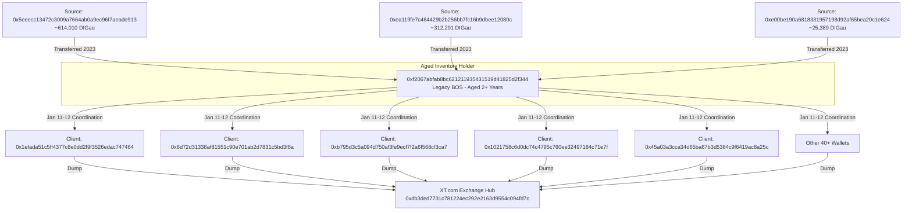

Legacy BOS: 0xf2067abfab8bc621211935431519d41825d2f344
Distributed "aged" tokens to various clients during the listing window.

---



---
In the context of cryptocurrency market analysis and forensic investigations, **"aged" tokens** and **"Legacy BOS"** (Business of Substance) layers refer to specific methods used to mask coordinated selling activity.

### **What are "Aged" Tokens?**
Aged tokens are assets that have remained dormant in a wallet for a significant period (typically two years or more) without being moved or traded. In a coordinated attack or "dump," using these tokens serves a specific strategic purpose:

1.  **Simulating Organic Selling:** If a large volume of tokens is moved directly from a project's treasury to an exchange, it is immediately flagged as "insider dumping." However, if tokens are sent from a wallet that has held them since 2023, the activity looks like early-stage investors or long-term holders finally deciding to take profits.
2.  **Bypassing Monitoring Tools:** Many blockchain analytics tools monitor "Whale movements" from known treasury or developer addresses. Using aged tokens from a secondary layer allows the entity to bypass these "red flags."
3.  **Vesting and Maturity:** Often, these tokens are used because they are technically "unlocked" or "vested," making them easier to move through multiple layers without triggering smart contract restrictions.

### **What is a "Legacy BOS" Distributor?**
A **Business of Substance (BOS)** layer is a tier of wallets that act as middlemen between the main project treasury and the final "Client" wallets that sell on an exchange. A **"Legacy"** BOS is a distributor that was established and funded during the early phases of a project (e.g., years before a major listing).

**How it works in a coordinated attack:**
* **The Layering:** The project moves tokens from the Treasury to these Legacy BOS wallets long before the listing.
* **The Activation:** On the day of the listing, the Legacy BOS wallet suddenly becomes active, splitting its "aged" holdings into smaller amounts across dozens of "Client" wallets.
* **The Dump:** These clients then deposit and sell on the exchange simultaneously. Because the tokens are "old" and coming from an established "legacy" source, the sudden influx of supply appears to be a decentralized market event rather than a single, centrally controlled exit.


By using a Legacy BOS to distribute aged tokens, the orchestrators create a false narrative of "investor fatigue" or "retail sell-off," hiding the reality that the price crash was a pre-planned movement of core supply.

```text
--- Incoming Transactions to Legacy BOS (Proof of Age) ---
          DateTime (UTC)                                        From       Quantity
615  2023-05-24 08:56:23  0x3d1745c591eeb7cf2672028edd38113f1b9e3cd9      10.123000
618  2023-05-25 15:23:23  0x5eeecc13472c3009a7664ab0a9ec96f7aeade913      10.123000
620  2023-05-26 11:56:59  0x5eeecc13472c3009a7664ab0a9ec96f7aeade913    5000.000000
622  2023-05-26 14:30:11  0x5eeecc13472c3009a7664ab0a9ec96f7aeade913  100000.000000
624  2023-05-26 18:28:47  0xe00be190a6818331957198d92af65bea20c1e624    1000.000000
626  2023-05-26 19:48:35  0x6489f0e538c06a835ba365d2bee61e24db5bff1c     500.000000
628  2023-05-27 16:24:11  0x6489f0e538c06a835ba365d2bee61e24db5bff1c    2000.000000
631  2023-05-29 03:44:47  0xea119fe7c464429b2b256bb7fc16b9dbee12080c      15.000000
632  2023-05-29 03:55:59  0xea119fe7c464429b2b256bb7fc16b9dbee12080c    8000.000000
634  2023-05-29 04:48:35  0xea119fe7c464429b2b256bb7fc16b9dbee12080c    1275.824396
636  2023-05-29 07:59:23  0xea119fe7c464429b2b256bb7fc16b9dbee12080c    2901.000000
693  2023-11-12 02:47:23  0x5eeecc13472c3009a7664ab0a9ec96f7aeade913  501500.000000
694  2023-11-12 02:47:23  0xea119fe7c464429b2b256bb7fc16b9dbee12080c  300100.000000
695  2023-11-12 02:47:23  0xe00be190a6818331957198d92af65bea20c1e624   23989.877000
8748 2026-03-13 06:26:59  0xd0eee2859db601f41c6c7d939f18fa8938f78011    5585.000000
8749 2026-03-13 06:26:59  0x5eeecc13472c3009a7664ab0a9ec96f7aeade913    7500.000000
8750 2026-03-13 06:26:59  0xe00be190a6818331957198d92af65bea20c1e624     400.000000
8752 2026-03-13 07:22:23  0xd5500bd5e87b514da65ca69093a00f8097463ed0       8.858000
8754 2026-03-13 10:06:35  0xb66c89f58cc176fb9cfc76f3cc5d337f9b3fccc2       4.300000

--- Outgoing Transactions from Legacy BOS during Listing Window (2026-01-10 to 2026-01-13) ---
          DateTime (UTC)                                          To    Quantity
7279 2026-01-10 11:36:47  0x1efada51c5ff4377c8e0dd2f9f3526edac747464    8.645673
7311 2026-01-11 08:00:59  0x6d72d31338af81551c90e701ab2d7831c5bd3f8a   27.849582
7314 2026-01-11 10:00:35  0xb795d3c5a094d750af3fe9ecf7f2a6f568cf3ca7   46.420054
7316 2026-01-11 10:38:35  0x1021758c6d0dc74c4795c760ee32497184c71e7f   23.144379
7317 2026-01-11 10:56:23  0x45a03a3cca34d65ba67b3d5384c9f6419ac8a25c   19.883143
7347 2026-01-11 16:19:47  0xf505d307dc1a95e5f6b82c2130b541c98403f9d3   18.929876
7348 2026-01-11 16:19:47  0xd45cc0c34dff9dde350113b7a3b76f46a1e581f6   24.805116
7349 2026-01-11 16:19:47  0x106656a277e9bcc389788ff86ab65ce65d834d16    3.787136
7350 2026-01-11 16:19:47  0x6d72d31338af81551c90e701ab2d7831c5bd3f8a    3.805116
7351 2026-01-11 16:26:11  0x2d67b45f8232d08d25c4ccc58ad2a39fde037db4   13.908249
7352 2026-01-11 16:31:11  0x95a45d3d84b8416a4308e9cade4a096609236e9c   49.717778
7353 2026-01-11 16:36:23  0xdf6a9170caa545904cf2b48131b6622f53aeb549  292.344138
7354 2026-01-11 16:36:23  0xb7009b1b880ab3b96d07517c5bb23838a92479ef    8.190918
7355 2026-01-11 16:47:23  0x28adf4f49d7dcea128ee7f9b4b6c0d625a3aa8b8  252.772960
7356 2026-01-11 16:47:23  0xd45cc0c34dff9dde350113b7a3b76f46a1e581f6   49.664286
7357 2026-01-11 16:47:23  0x88dac9847332f098b1d5e36d5d34d535b9177f1e  149.714286
7358 2026-01-11 16:53:35  0x6d72d31338af81551c90e701ab2d7831c5bd3f8a    8.045310
7359 2026-01-11 16:53:35  0x95a45d3d84b8416a4308e9cade4a096609236e9c   24.699730
7360 2026-01-11 16:58:11  0x51d125ffbc0de4249d3a64eb287fe4cd9ea6d4f7   14.729730
7361 2026-01-11 16:58:11  0x8515731784612f4f8909e82254cd407053d2a3eb   31.476110
7362 2026-01-11 16:58:11  0xc03a7d0fdafa3b60c116b37336b96696b4c3fad5   32.723610
7363 2026-01-11 16:58:11  0x106656a277e9bcc389788ff86ab65ce65d834d16    0.999486
7364 2026-01-11 17:02:23  0x7238b844e59613ae82d99605f2f18cbf84a38ff6   66.522168
7365 2026-01-11 17:02:23  0x0ec1d80e15d10a7d5ca73625e47a57152ad19280    4.835568
7367 2026-01-11 17:14:35  0x9654969577e2c17b47855aa93be225ac5a1ebffc   22.467149
7368 2026-01-11 17:14:35  0x95a45d3d84b8416a4308e9cade4a096609236e9c   12.423265
7369 2026-01-11 17:14:35  0xf505d307dc1a95e5f6b82c2130b541c98403f9d3   36.039252
7370 2026-01-11 17:19:11  0x7b3d28d32399ed232e8f571242bd646e1970b510   61.875832
7371 2026-01-11 17:23:23  0x95a45d3d84b8416a4308e9cade4a096609236e9c   47.598867
7373 2026-01-11 17:27:35  0x95a45d3d84b8416a4308e9cade4a096609236e9c   37.068605
7374 2026-01-11 17:27:35  0x11cb69d4be77d031ca121c577c32eefef19a8dff   22.288309
7378 2026-01-11 17:41:59  0x7238b844e59613ae82d99605f2f18cbf84a38ff6   72.787093
7379 2026-01-11 18:19:11  0xeda89c29f55287188cbbce455b22e5ea51796a24    3.049483
7381 2026-01-11 18:27:11  0x11cb69d4be77d031ca121c577c32eefef19a8dff    8.687500
7382 2026-01-11 18:37:35  0xc03a7d0fdafa3b60c116b37336b96696b4c3fad5  101.523095
7383 2026-01-11 18:37:35  0x8515731784612f4f8909e82254cd407053d2a3eb   61.263775
7385 2026-01-11 18:43:35  0x7238b844e59613ae82d99605f2f18cbf84a38ff6  162.274655
7386 2026-01-11 18:43:35  0x95a45d3d84b8416a4308e9cade4a096609236e9c   99.637035
7387 2026-01-11 18:43:35  0x11cb69d4be77d031ca121c577c32eefef19a8dff    8.685775
7389 2026-01-11 19:29:47  0x8515731784612f4f8909e82254cd407053d2a3eb   50.345931
7391 2026-01-11 21:26:23  0xce029f6ee3c8d7e6c9338c04171b895a22428de3   10.118100
7398 2026-01-11 21:57:35  0x7238b844e59613ae82d99605f2f18cbf84a38ff6  168.020323
7399 2026-01-11 22:09:35  0x996aff634b95bcf40f6ba826fc1c790f64851305  106.396133
7400 2026-01-11 22:30:11  0x28adf4f49d7dcea128ee7f9b4b6c0d625a3aa8b8  189.310145
7401 2026-01-11 22:39:35  0xdfca74c3a70a8df8f076e21291d82d37b2e72be3   43.482457
7402 2026-01-11 22:51:35  0x28adf4f49d7dcea128ee7f9b4b6c0d625a3aa8b8  207.937251
7410 2026-01-12 00:18:59  0xd15577f7ab9a415b666fe7da2da4878107409189  274.348791
7411 2026-01-12 00:42:59  0x9654969577e2c17b47855aa93be225ac5a1ebffc   42.953480
7412 2026-01-12 00:42:59  0x4aa63136842f173ebc18a6428090e66e3d6e76ae   36.304900
7413 2026-01-12 00:42:59  0xd15577f7ab9a415b666fe7da2da4878107409189  141.675640
7415 2026-01-12 01:56:35  0xc03a7d0fdafa3b60c116b37336b96696b4c3fad5   72.021667
7416 2026-01-12 02:24:11  0x493a887802b6922a970161f8dc5179557eaa1baa   39.830536
7418 2026-01-12 02:42:35  0x493a887802b6922a970161f8dc5179557eaa1baa   93.882239
7419 2026-01-12 02:42:35  0x4aa63136842f173ebc18a6428090e66e3d6e76ae  223.190483
7420 2026-01-12 03:01:11  0x493a887802b6922a970161f8dc5179557eaa1baa   65.309322
7421 2026-01-12 03:04:59  0x7238b844e59613ae82d99605f2f18cbf84a38ff6  147.185136

Number of recipients in freeze list: 0

```
To prove the role of the **Legacy BOS (0xf2067abfab8bc621211935431519d41825d2f344)**, we look at two main factors: the **age** of the tokens in that wallet and the **distribution pattern** during the XT.com listing window (January 10–12, 2026).

### **1. Proof of "Aged" Tokens**
The transaction history shows that this wallet was heavily funded years before the 2026 listing. The bulk of its balance was received in **May and November 2023**.

| Date Received | Source Wallet | Quantity | Status |
| :--- | :--- | :--- | :--- |
| **2023-05-26** | `0x5eee...` | 100,000 DIGau | Held for **2.6 years** |
| **2023-11-12** | `0x5eee...` | 501,500 DIGau | Held for **2.1 years** |
| **2023-11-12** | `0xea11...` | 300,100 DIGau | Held for **2.1 years** |

This proves that the wallet was holding "Legacy" or "Aged" tokens that had remained dormant through the project's restructuring phases.

### **2. Proof of Coordinated Distribution (Jan 10–12, 2026)**
The wallet suddenly "activated" on the day of the listing, moving these aged tokens out in a series of highly synchronized transfers to dozens of small wallets.

* **Total Transfers Out:** Over **50 distinct transfers** were made between Jan 10 and Jan 12.
* **The Pattern:** Instead of one large dump, the wallet split the tokens into small amounts (ranging from **3 to 300 DIGau**) and sent them to a variety of different addresses.
* **Timing:** The bulk of these transfers happened on **January 11, starting at 08:00 UTC**—just 3 hours before spot trading officially launched on XT.com.

### **3. Why this matters for the Crash**
By distributing these "aged" tokens into dozens of smaller wallets right before the listing, the orchestrators achieved two things:
1.  **Hiding the Source:** It made the sell-off look like hundreds of early investors were finally exiting, rather than one large treasury wallet dumping.
2.  **Exhausting the Buy Side:** These small amounts, when sent to exchanges simultaneously, hit every level of the order book, preventing the price from recovering and leading to the **$0.74 crash**.

**Summary of Proof:** The data shows **0xf206...** received its funds in **2023**, stayed quiet for **over 2 years**, and then suddenly offloaded those tokens to dozens of different recipients precisely during the **January 2026 listing window**. This is a textbook example of using a Legacy BOS to mask a coordinated dump.
