# Secure File Intake & Token Control Integration Architecture

## 1. Purpose

This document proposes a secure architecture for receiving externally
submitted files and safely ingesting them into the Token Control system
without exposing the secure environment to untrusted email/file threats.

Primary objectives:
- Eliminate direct email/mailbox access from the Token Control machine
- Prevent untrusted file execution on secure machines
- Enforce one-way controlled data flow
- Maintain full audit and traceability
- Secure file storage against unauthorized access

------------------------------------------------------------------------

## 2. Current Risk

If Gmail or external attachments are opened directly on the Token
Control machine, it creates significant risk:

- Malware infection (macro-based, embedded payloads, zero-day exploits)
- Credential theft or token exfiltration
- Ransomware propagation
- Compromise of secure infrastructure
- Lack of structured audit trail

A secure system must never directly process untrusted internet files.

------------------------------------------------------------------------

## 3. Core Security Principle

Untrusted files must never be opened or directly accessed on the Token
Control machine.

Data must flow in one direction only:

External -> Dignity Server -> Token Control

Token Control must:
- Not manually access Gmail/email attachments
- Not manually open untrusted attachments
- Only ingest files via controlled backend API

Important:
- Desktop policy controls (OS/network policy) may restrict email/mailbox
  access on the machine.
- TokCon application code should not enforce generic internet
  restrictions. Restriction or no restriction is a desktop policy
  decision.

------------------------------------------------------------------------

## 4. High-Level Architecture Flow

```mermaid
flowchart LR
    A["External User / Email / Upload"] --> B["Quarantine Intake Area - Dignity Server"]
    B --> C["Automated Scan & Validation"]
    C --> D["Sanitization & Format Normalization"]
    D --> E["Encrypted Secure Storage / File Digest DB"]
    E --> F["Token Control Backend API Pull - Read Only"]
    F --> G["Token Control Processing Engine"]
    G --> H["File Marked Inactive - Retained for Audit"]
```

------------------------------------------------------------------------

## 5. Detailed Workflow

### Step 1 --- File Intake (Untrusted Zone)

Files are received via:
- Secure upload portal
- Controlled mailbox integration
- Secure SFTP endpoint

Rules:
- No human opens attachments directly.
- Files land in a quarantined intake area.
- Intake environment is isolated from Token Control.

------------------------------------------------------------------------

### Step 2 --- Automated Scanning & Validation

Each file undergoes:
- Antivirus scan
- File type validation (MIME + signature check)
- Blocking of executables and scripts
- Macro detection
- File size and structure validation
- SHA-256 hash generation

If validation fails:
- File is rejected
- Event logged
- Notification triggered

------------------------------------------------------------------------

### Step 3 --- Sanitization & Normalization

Approved files are:
- Converted to safe format (e.g., PDF/A where applicable)
- Macros stripped
- Embedded scripts removed
- Metadata sanitized
- Re-encoded if structured (CSV, etc.)

------------------------------------------------------------------------

### Step 4 --- Secure Storage (File Digest System)

Files are stored:
- Encrypted at rest
- Inside database or secure object storage
- Not web-accessible
- Not publicly browsable

Metadata stored:
- File ID
- Hash (SHA-256)
- Timestamp received
- Validation status
- Processing status
- Pull status
- Full audit trail

------------------------------------------------------------------------

### Step 5 --- Controlled API Pull by Token Control

Token Control:
- Must not use Gmail/email attachment workflows
- Cannot manually browse untrusted intake directories
- Cannot manually open untrusted files

Instead:
- Authenticated backend API request
- Service-account based access
- Read-only pull
- Fully logged transactions

------------------------------------------------------------------------

### Step 6 --- Post-Pull Handling

After successful pull:
- File is marked Inactive
- Not permanently deleted
- Retained for audit and traceability
- Cannot be re-pulled without authorization

Retention policy to be defined (e.g., 12--24 months).

------------------------------------------------------------------------

## 6. Security Controls Summary

- One-way controlled data flow
- No manual email/Gmail attachment handling on Token Control
- Encrypted storage
- No public directory exposure
- Strict service-level access control
- Full audit logging
- Hash verification for integrity
- File retention for forensic review

------------------------------------------------------------------------

## 7. Risk Reduction Achieved

This architecture prevents:
- Malware infection of secure systems
- Token theft via malicious documents
- Ransomware pivot into secure infrastructure
- Zero-day document exploitation
- Human error from manual file opening
- Unauthorized re-access of processed files

------------------------------------------------------------------------

## 8. Conclusion

This design ensures:
- Strong isolation of Token Control from untrusted file workflows
- Controlled and audited file ingestion
- Encrypted secure storage
- One-way secure architecture
- Compliance-ready audit trail

This significantly strengthens system security while maintaining
operational functionality.

------------------------------------------------------------------------

## 9. Implementation Stack (Current Program Direction)

- Backend API and worker services: FastAPI (Python)
- Frontend/admin interface: React + TypeScript
- Environment model: local development and server deployment use the
  same FastAPI codebase with environment-specific appsettings
- Containerization: not required (no Docker dependency in baseline plan)
- Access restrictions (email/Gmail): enforced by desktop policy, not by
  TokCon application-level internet restriction logic
